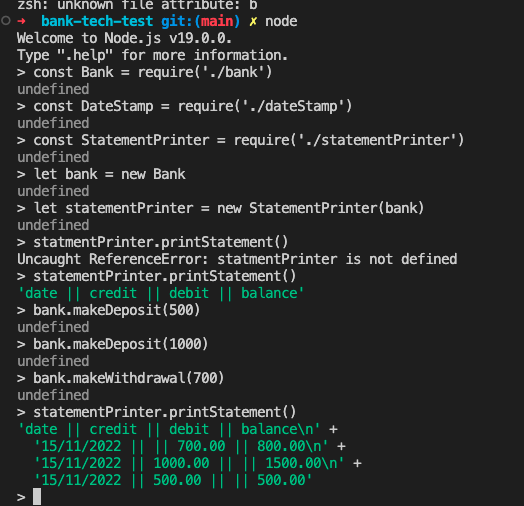

## Introduction

This is a bank application you can run from your command line using Node. You can make deposits and withdrawals (using the bank.makeDeposit(amount) and .makeWithdrawal(amount) functions) and print a statement using the statementPrinter.printStatement() function. The statement will indicate the date in which the operation was done, the amount under the type of operation and the balance after this operation.

## Approach

I decided to divide this program in different classes to stick to the single responsability principle.

We have a Bank class that is responsible for handling the withdrawal and deposit operations as well as calculating the total balance and storing these operations in an array.

There is an error handling class which handles errors within the Bank class' functions.

We also have a dateStamp class which is responsible for giving each operation a time stamp with the day, month and year where the operation was made.

Lastly, we have a StatementPrinter class responsible for formatting and printing the bank statement, using the operations stored by our Bank class.

## Setup

To do the application setup, please run the following commands from the root of the project:

Install node:

```bash
nvm install node
nvm use node
```

install dependencies:

```bash
npm install
```

Install jest

```bash
npm install -g jest
```

To run the tests

```bash
jest

# With coverage
jest --coverage
```

To use the application from your command line, run:

`node`

## Example of usage in node:

```bash
const Bank = require('./bank')
const DateStamp = require('./dateStamp')
const StatementPrinter = require('./statementPrinter')

let bank = new Bank
let statementPrinter = new StatementPrinter(bank)
statementPrinter.printStatement()

bank.makeDeposit(500)
bank.makeDeposit(1000)
bank.makeWithdrawal(700)
statementPrinter.printStatement()
# date || credit || debit || balance
# 17/11/2022 || || 700.00 || 800.00
# 17/11/2022 || 1000.00 || || 1500.00
# 17/11/2022 || 500.00 || || 500.00
```

You can see an example by running the following command on the terminal from the root of the project:

`node exampleUsage.js`



Note: User input accepts only numeric values (both integers and floating points) over 0.

## Acceptance criteria

Given a client makes a deposit of 1000 on 10-01-2023
And a deposit of 2000 on 13-01-2023
And a withdrawal of 500 on 14-01-2023
When she prints her bank statement
Then she would see

date || credit || debit || balance
14/01/2023 || || 500.00 || 2500.00
13/01/2023 || 2000.00 || || 3000.00
10/01/2023 || 1000.00 || || 1000.00
